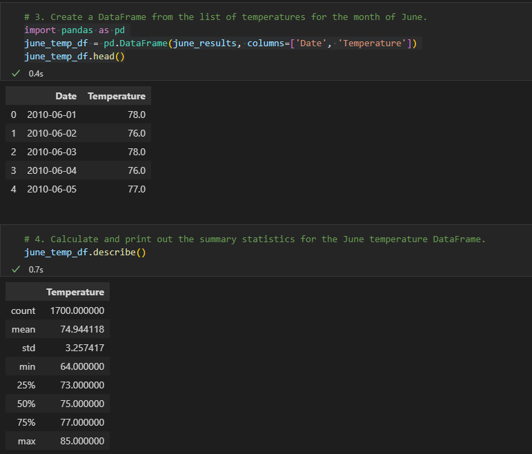
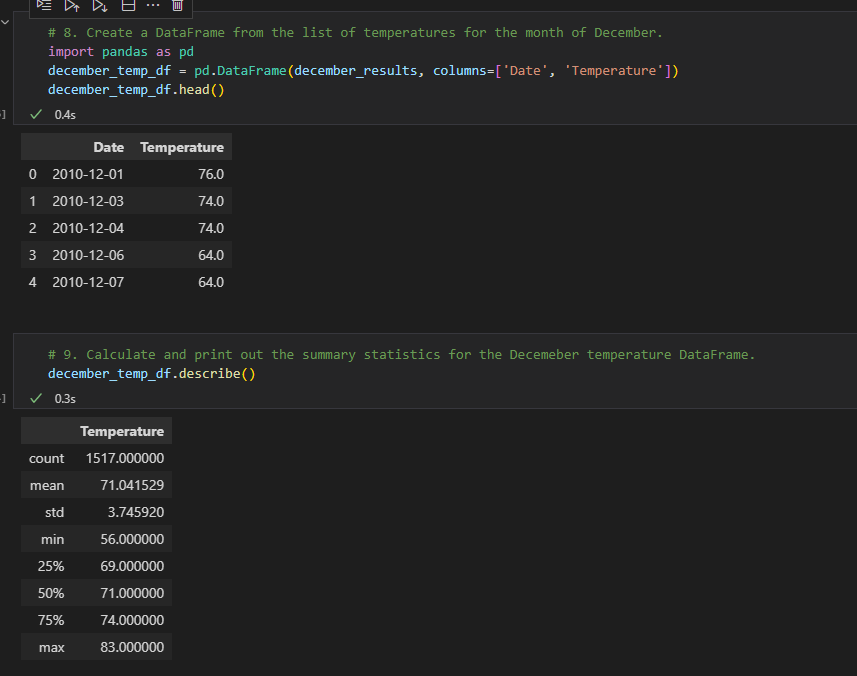

# surfs_up

## Overview of Analysis
The purpose of this analysis was to look at temperature trends for the months of June and December in Oahu, Hawaii. The reason for this is to see if a surf and ice cream shop business would be sustainable year-round. 

## Results
### June Temperature

.

### December Temperature

.

* The maximum temperature for June was 85 degrees, and the max temperature for December was 83 degrees. These are both great temperatures to enjoy ice cream and surfing.
* The minimum temperature for June was 64 degrees, and the min temperature for December was 56 degrees. Not bad in my opinion, especially knowing these are the coldest days recorded for these months.  
* The average temperature for June was 75 degrees, and the average temperature for December was 71 degrees. According to this information, the surf and ice cream shop would most definitly be sustainable year-round.

## Summary
The reason we pulled data from June and December is because June typically is a "warmer" time of the year, and December is typically a "colder" time of the year. After running the temperature analysis for these months, I think it would be more than safe to say that the Surf and Ice Cream shop could be sustainable year-round. Before we dive right in and set up shop, I think another query to run would be precipitation for the months of June and December. Also, I don't think it would be a bad idea to find out how many days of sunshine/overcast there are for the months of June and December. After running these last couple analysis, I think we will know for sure if a Surf and Ice Cream shop would be sustainable in Oahu, Hawaii. 
